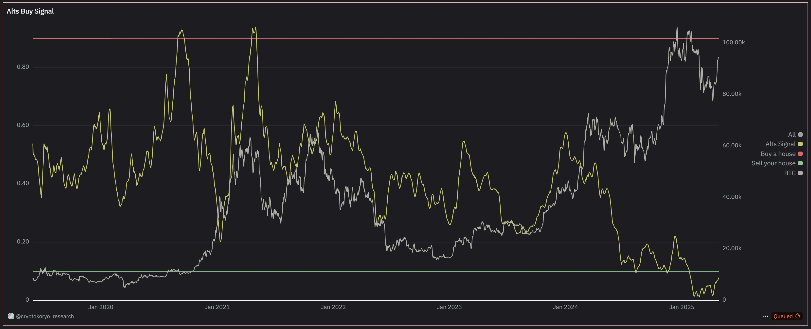
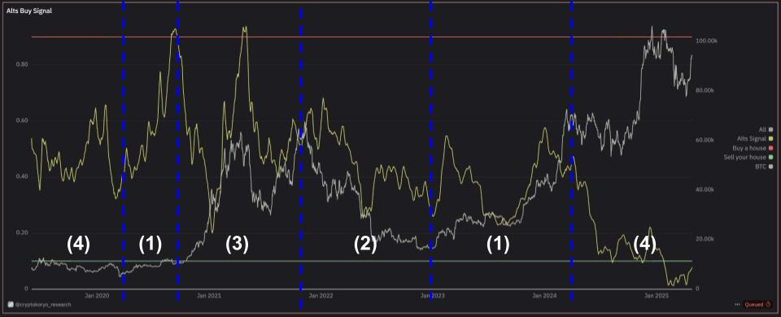

# Crypto Buy Signal 분석 프로젝트

본 프로젝트는 @cryptokoryo가 제작한 **Crypto Buy Signal** 대시보드를 기반으로,
시장 매수/매도 시그널을 온체인 데이터와 시가총액 변화를 통해 해석하고
이를 기반으로 투자자에게 인사이트를 제공하기 위한 분석 문서를 정리합니다.

---

## 📌 프로젝트 구성

### 1. 원본 시스템 설명
- TOTAL3 (BTC, ETH 제외 시가총액)
- Stablecoins (USDT, USDC 시가총액)
- BTCUSDT 가격
- 이를 조합한 Oscillator 지표 생성
- Alt Signal 값은 0과 1 사이를 오가며, 시장 강도를 나타냅니다.
  - **0.1 이하**: 극단적 공포, 세대적 매수 기회 (Generational Buy)
  - **0.9 이상**: 극단적 탐욕, 세대적 매도 신호 (Generational Sell)

- Alt Signal 값 계산 방법
  - Step 1: **순수 알트코인** 시가총액 계산
   → Pure_Alts = TOTAL3 - (USDT + USDC)
  - Step 2: **비트코인** 가격으로 스케일링
   → Alts_to_BTC = Pure_Alts / BTCUSDT
  - Step 3: 0 ~ 1 범위로 **정규화**
   → Normalized_Alts_Signal = (Current Alts_to_BTC - Min) / (Max - Min)\

### 2. 시나리오 해설
| 시나리오 | 설명 | 추천 행동 |
|:--------|:-----|:---------|
| (1) BTC↑, 알트↑ | 명확한 상승장 (Bull Rally) | 롱 진입, 알트 베팅 가능성 |
| (2) BTC↓, 알트↓ | 명확한 하락장 (Bear Market) | 스테이블 전환, 리스크 오프 |
| (3) BTC↓, 알트↑ | 단기 알트 강세 | 신중한 리스크 온 |
| (4) BTC↑, 알트↓ | BTC 주도 상승 (BTC Dominance 상승) | 알트 매집 기회 |

### 3. Alt Signal 핵심 철학
- **"Trust the Process"** → 감정과 소음에 흔들리지 말고, 시스템과 데이터만 신뢰해라
- 빠른 수익 쫓지 않기 → 단기 급등/급락에 휘둘리지 말고 장기 흐름에 집중해라
- 시스템 신뢰하고 긴 주기 대응 → 지금 당장의 수익이 아니라, 큰 사이클을 타라

### 4. 현재 시장 상황
- 단기: BTC와 알트 모두 하락 → 시나리오 (2) (Bear Market)
- 장기: BTC는 상승 추세 유지 → 시나리오 (4) (프리 불마켓)
- 현재는 (2)와 (4) 혼합된 과도기적 흐름
- 단기 리스크 관리와 함께, 장기적 강세 대비 준비 필요

### 5. 개인 인사이트
- 온체인 데이터와 시가총액 지표 조합은 신뢰성이 높은 편
- 단, 쿼리 비공개로 완벽 검증은 불가능
- 단기 트레이딩보다 중장기 트렌드 포착에 유리
- Alt Signal의 극단 값(0.1, 0.9)을 통해 시장의 극단적 심리를 포착할 수 있음

---

## 🎯 향후 계획
- Crypto Buy Signal 지표를 참고하여 시장 주요 변곡점 포착
- 자체 신호 지표 개선 아이디어 연구
- 콘텐츠로 재구성하여 대중성과 전문성 강화

---

> 작성자: 코인크래프트  
> 프로젝트 목적: "온체인 데이터 분석가로서 시장을 해석하고, 성장하는 여정을 기록하기 위함."
